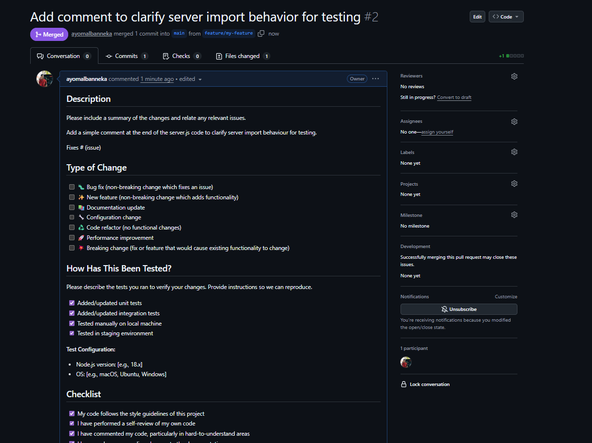

# Beginner Badge Submission - Your Name

**Date:** January 2026
**Status:** Submitted for Review

## Tasks Completed

- [x] Task 8: Artifacts uploaded & downloaded between jobs ✅
- [x] Task 9: Conditional execution (deploy on main only) ✅
- [x] Task 10: PR created with template & issue using template ✅

## Evidence

### Task 8: Artifacts uploaded & downloaded between jobs ✅

### Task 9: Conditional execution (deploy on main only) ✅
.png)
.png)

### Task 10: PR created with template & issue using template ✅

## Notes
Any challenges faced or additional context.

---

Submitted & ready for review! ✅